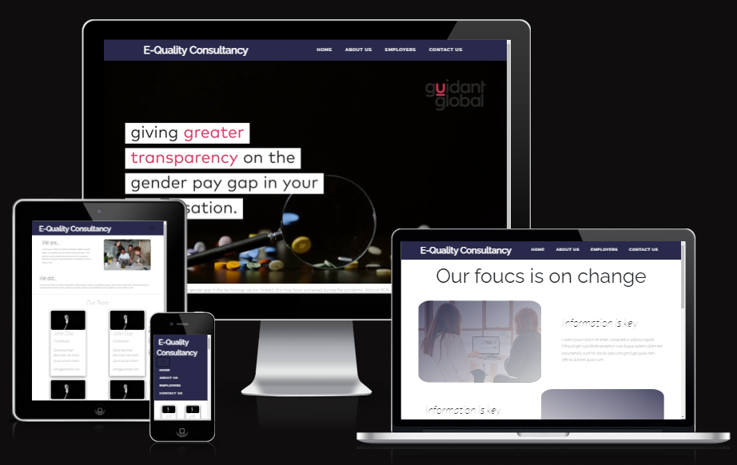
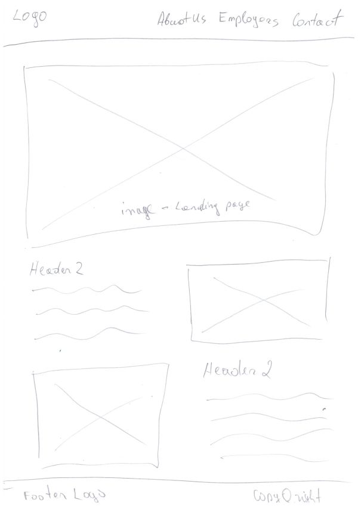
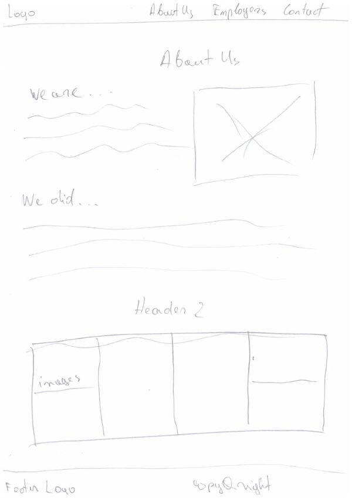
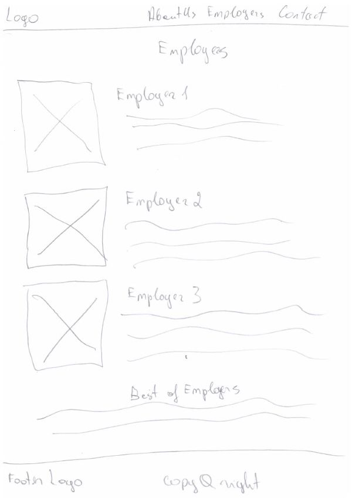
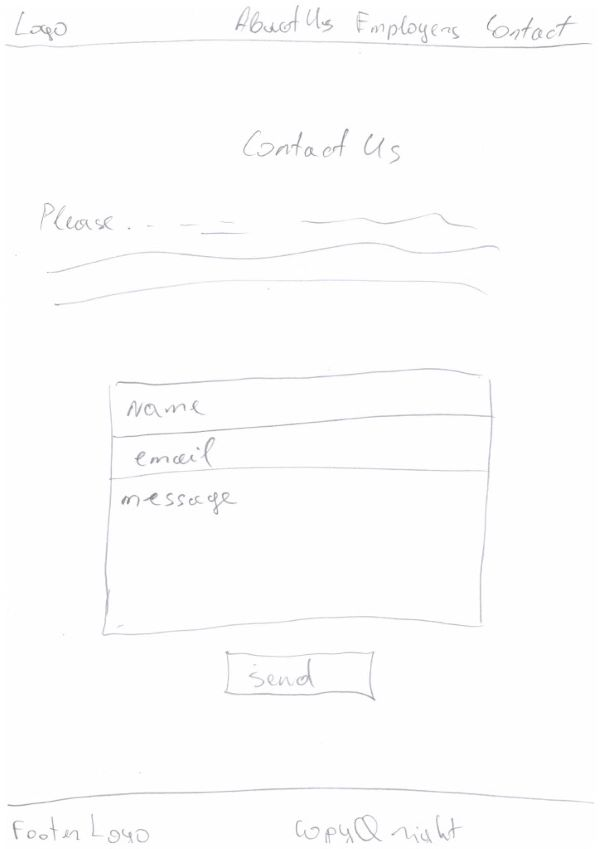
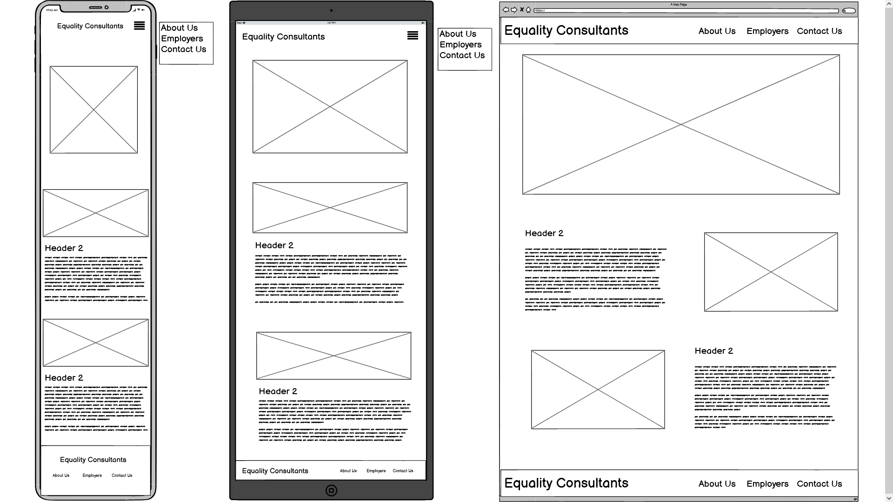
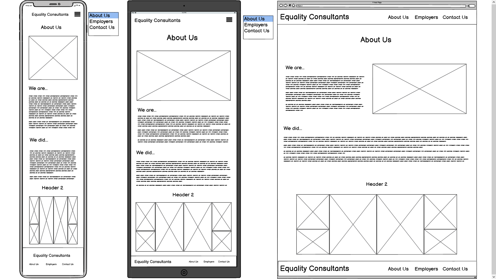
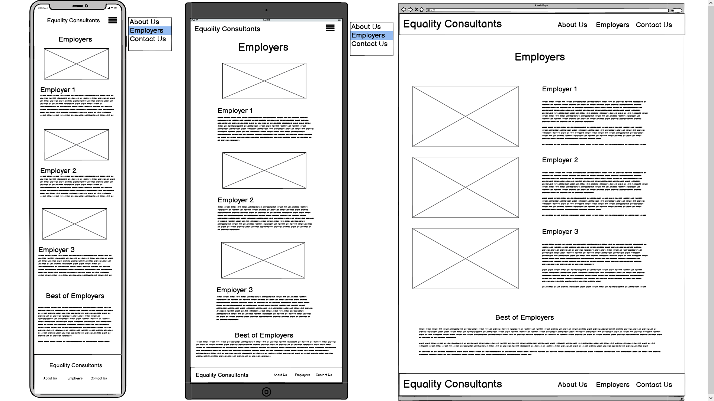
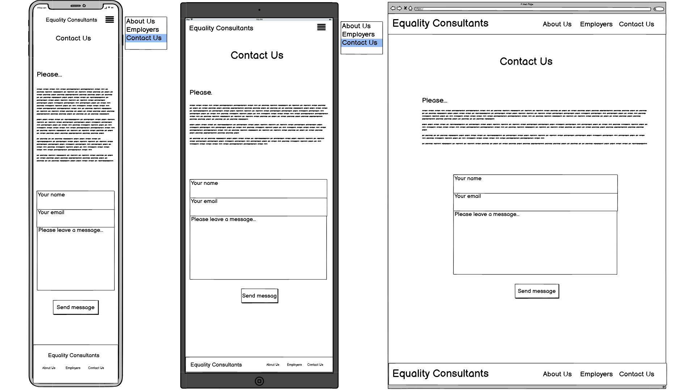
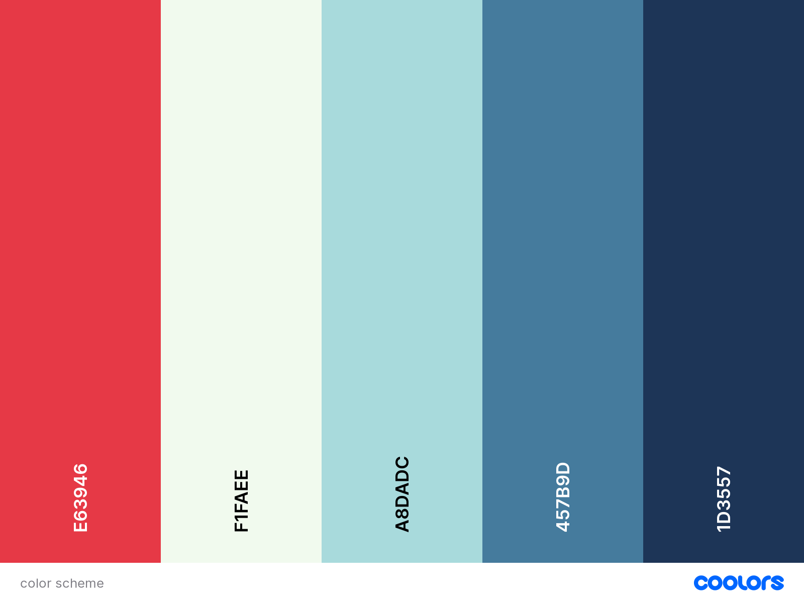

# September 2022 Hackathon | E-Quality Consultancy
 **REVIEW MOCKUP PLACEHOLDER IMAGE FOR NOW**

An informational website to promote **Gender Equality in the Workplace** from a hypothetical business.

[Visit the live site](https://stevenweir038.github.io/equality_consultants/)

## A Message to the September 2022 Hackathon Organisers & Hosts
To begin we would like to thank our event organisers and hosts - [The Code Institute](https://codeinstitute.net/), [Trust in SODA](https://www.trustinsoda.com/) and [Deloitte](https://www2.deloitte.ie/).

There is a great deal of time and knowhow that goes into a event like this.  We look forward to working with others, do some networking and learn more more from industry leaders.

## Our Team
Our team called consisted of 5 members who have never met.  They are:

- Andruis S (Enthusiast)
- Fran (Enthusiast)
- StevenW (Newbie)
- John de Lara (Newbie)
- Eoghan Behan (Newbie)

We are inexperienced so choose to develop static website.
By limiting technologies used to HTML5, CSS3 and Javascript, project development was accessible to all members as we shared in these compentancies.
Further considerations were:
- the option for more experienced team members to use Bootstrap5 framework without compromising other using vanilla HTML/CSS
- limited development time before presentation
- simplier deployment through GitHub Pages.

# Planning Phase
## Strategy Plane
### Site Aims

### Opportunities

## Scope Plane
### Must Have
### Should Have
### Could Have

## Skeleton Plane
## User Stories
1. As a **site user**, I want to **visit the landing page** so that **I can understand the purpose of the site**
2. As a **site user**, I want to **visit the about page** so that **I can understand the companys mission**
2. As a **site user**, I want to **visit the about page** so that **view the company employees and their roles**
3. As a **site user**, I want to **do visit the employers page** so that **navigate to external studies by the Irish government**
4. As a **site user**, I want to **use a contact form** so that **I can conveniently send the company an email**

## Wireframes
### Landing page

### About Us

### Employers

### Contact Us

### Landing page (low to high res)

### About Us page (low to high res)

### Employers page (low to high res)

### Contact Us page (low to high res)

## Surface Plane
### Color Schema

### Typography
Lato & Raleway were selected. Both look professional and provide a high degree of accessibility.

## Agile / Project Management
*GitHub Projects* was used to assist project management using a basic Kanban. Draft items were created then converted into issues and assigned to individual team members.  The the SCRUM Master then dragged the items from ToDo to In Progress then Complete after communicating with the team.

As the event took, place over 5 days a call took place at the beginning and end of each day to agreed on task completion/issue closure.

## Features

## Future Development Oppurtunities

## Testing
### Known Issues
#### Resolved

#### Unresolved

## Deployment
As the site was static, it was deployed using *GitHub Pages*.  The steps to deploy are as follows:

- In the GitHub repository, navigate to the *Settings* tab
- In the Source section select *Deploy from a branch* option in the drop-down menu
- In the Branch section select *main* option in the drop-down menu
- Keep directory set to the */root*.
- The page will reload with a link to the live site

The live link can be found here - https://stevenweir038.github.io/equality_consultants/

## Local Deployment
In order to make a local copy of this repository, you can clone the project by typing the follow into your IDE terminal:
- `git clone https://github.com/StevenWeir038/equality_consultants.git`

Alternatively, if using Gitpod, you can click below to create your own workspace using this repository.

## Technologies Used
Project Planning & Management
- [Balsamiq](https://balsamiq.com/) for wireframes
- [Coolors](https://coolors.co/) to research colour schemas.
- [GitHub](https://github.com/) for
    - for repository storage
    - Agile project management using kanban boards/issue tracking.
    - static site deployment

Team members used different IDE's including:
- [GitPod](https://gitpod.io/)
- [VSCode](https://code.visualstudio.com/)

Languages & Frameworks/Resources
- [CSS3](https://www.w3.org/Style/CSS/Overview.en.html)
- [HTML5](https://developer.mozilla.org/en-US/docs/Learn/HTML)
- [Javascript](https://www.javascript.com/)
- [Bootstrap 5](https://getbootstrap.com/docs/5.2/getting-started/introduction/)

Other
- [Chrome DevTools](https://developer.chrome.com/docs/devtools/)
- [Google Fonts](https://fonts.google.com/)
- [Fontawesome 6](https://fontawesome.com/)
- [EmailJS](https://www.emailjs.com/) **CHECK DID ANDRUIS KEEP USING EmailJS**

Validators **USE ON SATURDAY WHEN TEAM GETS TOGHTHER IN PERSON**
- [W3C Markup Validator](https://validator.w3.org/) HTML linter
- [Jigsaw](https://jigsaw.w3.org/css-validator/) CSS linter
- [JSHint](https://jshint.com/) JS linter
- [PEP8](http://pep8online.com/) Python linter

**CHECK WITH TEAM IF MORE TO ADD**

## Credits

### Content

- **get research off Eoghan** 

### People

Our thanks to:
- our Facilitator [Anthony O'Brien](https://www.linkedin.com/in/anthony-o-%E2%80%8B-brien-8324a5139/)
- the Slack community at Code Institute