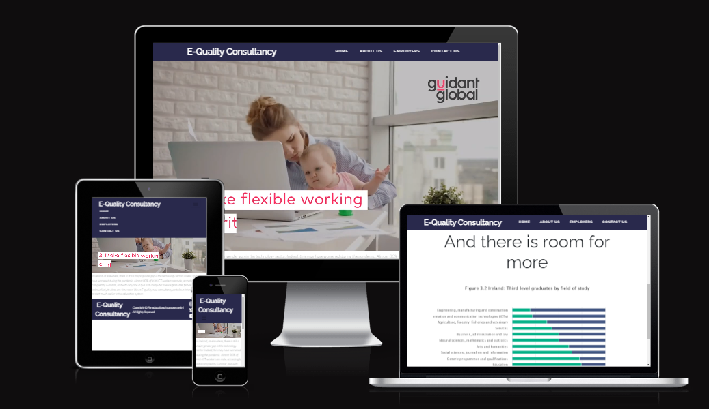

# September 2022 Hackathon | E-Quality Consultancy
 **REVIEW MOCKUP PLACEHOLDER IMAGE FOR NOW**

An informational website to promote **Gender Equality in the Workplace** from a hypothetical business.

[Visit the live site](https://stevenweir038.github.io/equality_consultants/)

## A Message to the September 2022 Hackathon Organisers & Hosts
To begin we would like to thank our event organisers and hosts - [The Code Institute](https://codeinstitute.net/), [Trust in SODA](https://www.trustinsoda.com/) and [Deloitte](https://www2.deloitte.ie/).

There is a great deal of time and knowhow that goes into a event like this.  We look forward to working with others, do some networking and learn more more from industry leaders.

## Our Team
Our team consisted of 5 members who have never met.  They are:

- Andruis S (Enthusiast)
- Fran (Enthusiast)
- StevenW (Newbie)
- John de Lara (Newbie)
- Eoghan Behan (Newbie)

Together we developed a static website based upon our core compentancies.
Welcome to E-Quality Consultancy. A site developed by **REVIEW TEAM NAME**.  
